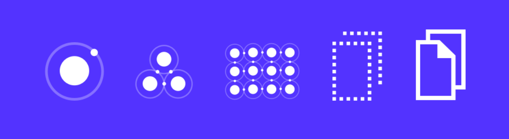

<div align="center"><h1>Design System Project</h1></div>

## 🎨 [Figma Project](https://www.figma.com/file/NX0VGxYYCxoZeZomWzhhtP/Design-System?node-id=0%3A1)

## 📚 Stack

- React
- TypeScript
- Tailwind CSS
- Storybook

## ⚙️ Setup

The project was created using Vite with React and TypeScript options:
```
npm create vite@latest
```

Installing dependencies:
```
npm install
```

Running the application:
```
npm run dev
```

Next step was to install Tailwind CSS and create the config files:
```
npm i -D tailwindcss postcss autoprefixer
```

```
npx tailwindcss init -p
```

Finally, Storybook was configured using Vite and NPM parameters:
```
npx storybook init --builder @storybook/builder-vite --use-npm
```

Running the Storybook:
```
npm run storybook
```

## 🔧 Another libraries

- **clsx**: for constructing className strings conditionally.
```
npm i --save clsx
```
- **radix-ui**
  - `/react-slot`: lets you choose which HTML tag you want to use in your component.
  - `/react-checkbox`: a checkbox component ready to style.
```
npm i @radix-ui/react-slot

npm i @radix-ui/react-checkbox
```
- **phosphor-react**: icon family for React.
```
npm i phosphor-react
```
- **storybook**
  - `storybook-deployer`: allows you to deploy your Storybook into a static hosting service like GitHub Pages.
  - `addon-a11y`: addon to check web accessibility standards.
  - `addon-interactions, jest, testing-library, test-runner`: allows you to write tests and to simulate user interactions to run after a story renders.
```
npm i @storybook/storybook-deployer --save-dev

npm i @storybook/addon-a11y

npm i @storybook/addon-interactions @storybook/jest @storybook/testing-library @storybook/test-runner --save-dev
```
- **axios**: HTTP client.
```
npm i axios
```
- **msw**: mock by intercepting requests on the network level.
```
npm i msw msw-storybook-addon --save-dev
```
